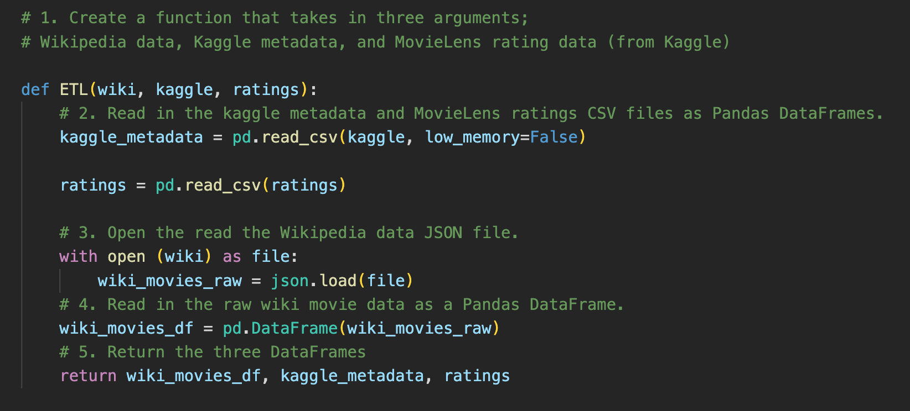
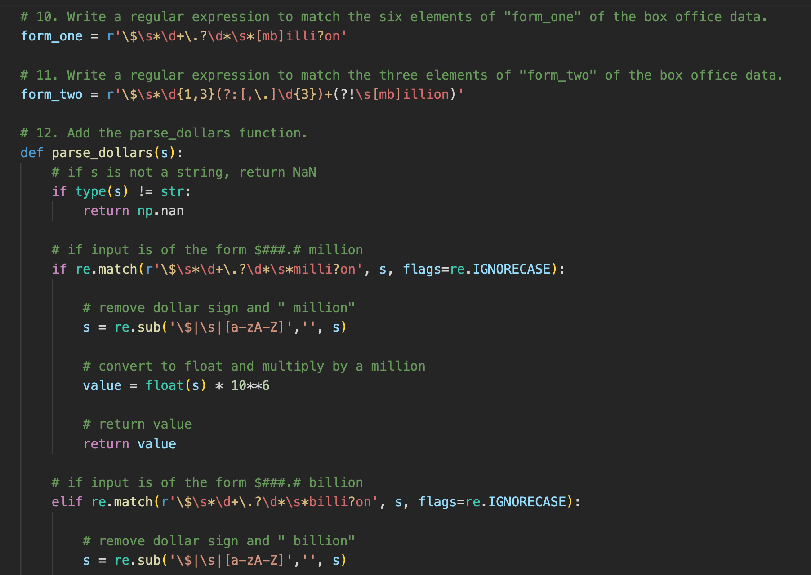
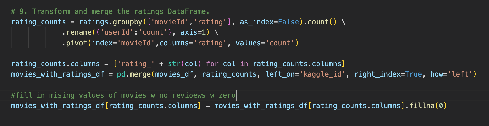
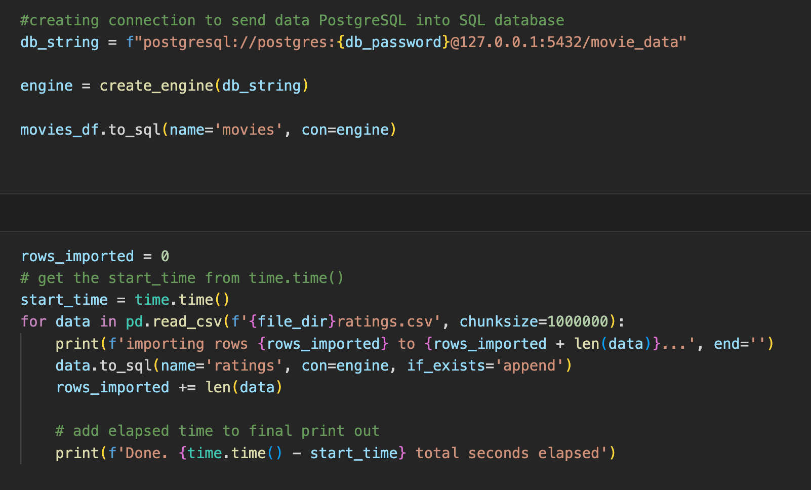

# Wiki_Movies-ETL

# Overview

This project worked with two impressively large CSV files, one scrapped from Wikipedia and the other from an open-source movie rating dataset on Kaggle through the Extract, Transform and Load pipeline.  The data sets were cleaned and organized using Python and loaded into a database with PostgreSQL.

# Results 

The project consists of four deliverables.  The first `ETL-function_test` reads the separate data files into three DataFrames using the `pd.read_csv` and `json.load` functions.  

The second deliverable `ETL_clean_wiki_movies` extracts and transforms the data from Wikipedia so it can be merged later.  RegEx was used extensively to ensure that the date, money and time data are formatted consistently.  Here’s one example of the steps taken to format box office dollars.  

The third deliverable `ETL_clean_kaggle_data` extracts and transforms the open source rating data from Kaggle and MovieLense to merge with the previous dataset for a single source of movie and rating data.  In this example, a left merge was used to retain all the movie data, while including rating data where available.  

The last deliverable takes the finalized DataFrame and loads it into a database using PostsgreSQL.  

